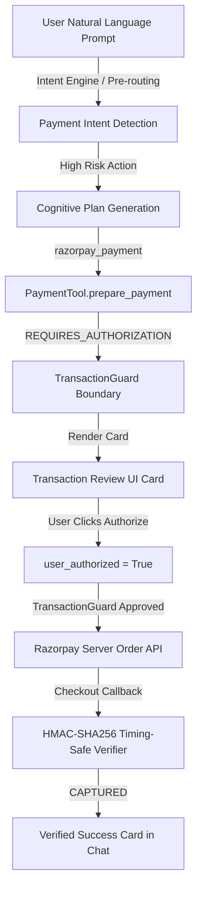

# HELIOS — Agentic Payment Integration Specification

## Overview

The HELIOS Phase 2 Agentic Payment Integration connects the Phase 1 Razorpay Payment Subsystem (`core/payments/` & `payment_service/`) into the active HELIOS natural language understanding, cognitive planning, tool routing, and Tkinter UI (`ui/chat_view.py` & `helios_popup.py`).

## Core End-to-End Pipeline

## Core Components & File Mapping

1. **NL Intent Classifier & Pre-Routing**:
   - `core/nl_router.py`: Rule 20 natural language payment classification.
   - `agent.py`: Guard 0.6 pre-routing shortcut for payment execution vs informational queries.
2. **Tool Capability Adapter**:
   - `core/payments/helios_payment_adapter.py`: Interface bridge for HELIOS cognitive planning tools.
   - `core/payments/payment_models.py`: Strongly typed `PaymentContext`, `PaymentIntent`, and `TransactionState` state machine.
3. **Transaction Review & UI Cards**:
   - `ui/chat_view.py`: `add_payment_transaction_card()` and `add_payment_result_card()`.
   - `helios_popup.py`: `_on_payment_authorize()` and `_on_payment_cancel()` callback handlers.
