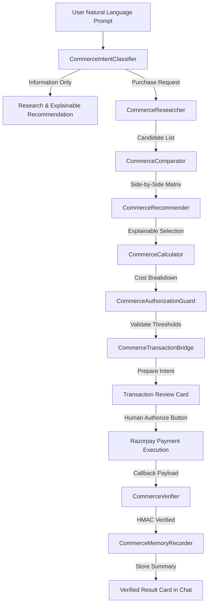

# HELIOS — Phase 3 Agentic Commerce Architecture

## Overview

The HELIOS Phase 3 Agentic Commerce Orchestration Subsystem (`core/commerce/`) introduces an end-to-end natural-language-to-verified-payment commercial execution capability for the Razorpay Buildathon.

## System Architecture Diagram

## Modular Package Structure (`core/commerce/`)

- `commerce_models.py`: Strongly typed dataclasses (`CommerceIntent`, `ProductCandidate`, `ComparisonTable`, `RecommendationResult`, `CostBreakdown`, `CommerceContext`, `CommerceState`).
- `commerce_intent.py`: Classifier for Information-Only, Purchase Preparation, Purchase Request, and Payment-Only requests.
- `commerce_researcher.py`: Product research orchestrator.
- `commerce_comparator.py`: Deterministic comparison matrix builder.
- `commerce_recommender.py`: Transparent, explainable recommendation engine.
- `commerce_calculator.py`: Financial total breakdown engine (Exact vs Estimated).
- `commerce_transaction.py`: Bridge reusing Phase 1 Razorpay payment subsystem.
- `commerce_authorization.py`: Hard safety policy boundary for human authorization.
- `commerce_verifier.py`: Server-side timing-safe HMAC signature verifier.
- `commerce_memory.py`: Persistent memory recorder in HELIOS knowledge base.
- `commerce_trace.py`: Auditable 16-state trace recorder.
- `commerce_orchestrator.py`: Master orchestrator driving commercial lifecycle.
- `commerce_demo.py`: Buildathon Demo Engine.
