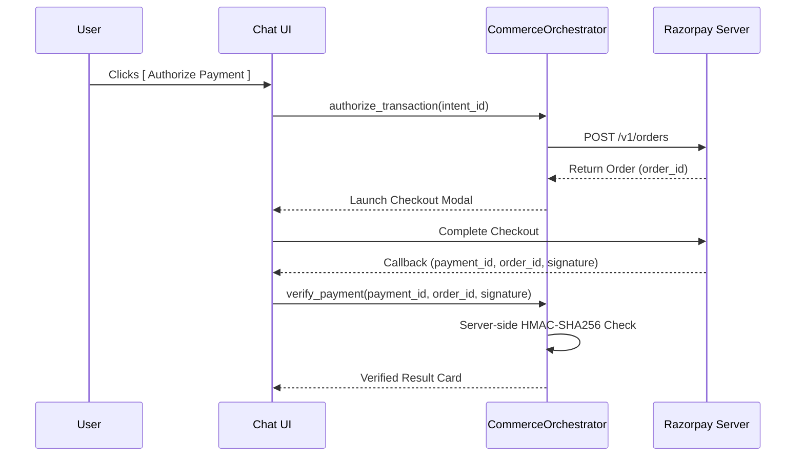

# HELIOS — Payment Execution Flow

## Razorpay Integration Sequence

```mermaid
sequenceDiagram
    participant User
    participant UI as Chat UI
    participant Orch as CommerceOrchestrator
    participant RZP as Razorpay Server

    User->>UI: Clicks [ Authorize Payment ]
    UI->>Orch: authorize_transaction(intent_id)
    Orch->>RZP: POST /v1/orders
    RZP-->>Orch: Return Order (order_id)
    Orch-->>UI: Launch Checkout Modal
    UI->>RZP: Complete Checkout
    RZP-->>UI: Callback (payment_id, order_id, signature)
    UI->>Orch: verify_payment(payment_id, order_id, signature)
    Orch->>Orch: Server-side HMAC-SHA256 Check
    Orch-->>UI: Verified Result Card
```
