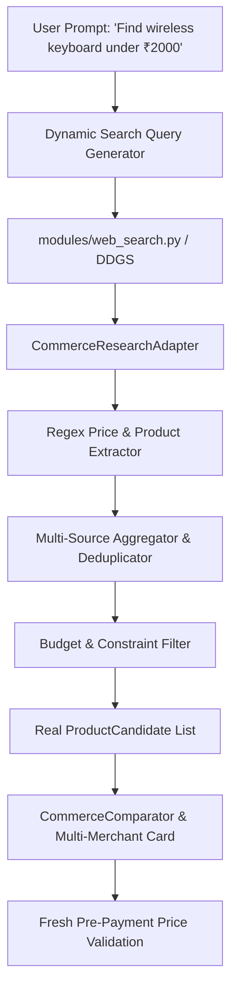

# HELIOS — Commerce Research Audit Report

## 1. Executive Summary

This audit assesses the product research, price comparison, URL attribution, and recommendation pipeline in HELIOS Phase 3. Prior to this fix, `CommerceResearcher` relied on static demonstration candidate objects (`DEMO_STATIC`) for hardcoded items (like Logitech K380, Redgear Shadow Blade) and generated fallback candidates (`GENERATED`) for other queries.

This document classifies every data field across the commerce research pipeline and defines the architectural plan for real-time web search integration using `modules/web_search.py`.

---

## 2. Field-by-Field Source Classification

| Subsystem / Data Field | Current Classification | Description / Source |
| :--- | :--- | :--- |
| **`ProductCandidate.name`** | `DEMO_STATIC` / `GENERATED` | Hardcoded for "keyboard" & "gift"; generated title for other items. |
| **`ProductCandidate.price_inr`** | `DEMO_STATIC` / `GENERATED` | Static values (₹1,799, ₹1,999) or budget-derived calculation (`budget * 0.9`). |
| **`ProductCandidate.merchant`** | `DEMO_STATIC` / `GENERATED` | Static string ("Amazon India", "Flipkart") or user input. |
| **`ProductCandidate.source_url`** | `MISSING` / `DEMO_STATIC` | Currently empty string `""` or unverified static domain. |
| **`ProductCandidate.rating`** | `DEMO_STATIC` / `GENERATED` | Static float value (4.6, 4.4). |
| **`ProductCandidate.review_count`** | `DEMO_STATIC` / `GENERATED` | Static integer (1420, 890). |
| **`ProductCandidate.features`** | `DEMO_STATIC` / `GENERATED` | Static feature lists. |
| **`ProductCandidate.pros` & `cons`** | `DEMO_STATIC` / `GENERATED` | Static text arrays. |
| **`ProductCandidate.confidence`** | `GENERATED` | Fixed heuristic float (0.98, 0.95). |
| **`WebSearch` Engine (`ddgs`)** | `REAL_LIVE` | DuckDuckGo search returning real titles, snippets, and URLs. |
| **Price Verification Guard** | `MISSING` | Pre-payment price re-validation check before `create_order`. |
| **Multi-Source Deduplication** | `MISSING` | Aggregating price offers across Amazon, Flipkart, Croma for the same product. |
| **Price Type Tracking** | `MISSING` | Distinguishing `LIVE_PRODUCT_PAGE`, `SEARCH_RESULT`, `DEMO_FIXTURE`. |
| **Stale Price Protection** | `MISSING` | Tracking `retrieved_at` timestamp with freshness thresholds. |

---

## 3. Architecture Plan for Real Web Search Integration

## 4. Verification Policy

1. Every live product result must expose a real source URL and source name.
2. Prices must be extracted deterministically from live web snippets/pages.
3. If web search yields zero verifiable results, HELIOS must state that it could not retrieve reliable current prices rather than creating fake data.
4. Demo Mode will remain available and explicitly labeled as `DEMO_FIXTURE`.
