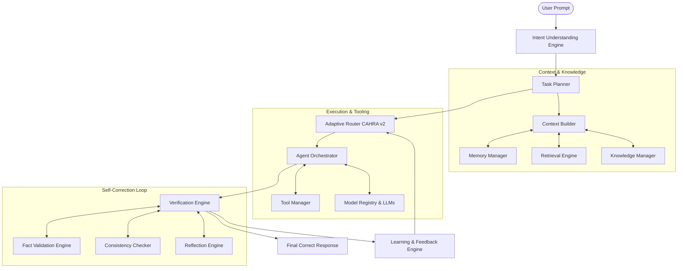

# HELIOS v2: The Next-Generation Intelligent Hybrid AI Platform
## Complete Research Architecture & System Design Specification

---

## 1. Vision Statement

HELIOS v2 is conceived as the world’s most intelligent, reliable, and mathematically verifiable hybrid autonomous desktop AI platform. Transitioning from HELIOS v1.1—which successfully proved context-aware hybrid routing—HELIOS v2 shifts the focus from simple LLM model selection to **verifiable final response correctness**. It guarantees that every user interaction is contextually aware, tool-verified, logically sound, and explainable. The ultimate vision is a platform that serves as both a production-ready desktop companion and a frozen research baseline for advanced hybrid routing, model optimization, and agentic self-reflection.

---

## 2. Design Philosophy

HELIOS v2 is governed by five foundational design pillars:
1. **Tool-First Supremacy**: Probabilistic LLM generation is treated as a fallback. Deterministic tools (calculators, shell commands, database queries, and filesystem functions) are always preferred for tasks requiring exactness.
2. **Self-Verification and Correctness**: The final output delivered to the user must pass rigorous verification pipelines. An answer is never delivered if its confidence score lies below the calibrated truthfulness threshold.
3. **Continuous, Non-Destructive Learning**: The system adapts its routing and candidate model profiles continually based on local execution traces, user corrections, and verification failures, without corrupting its frozen core benchmark dataset.
4. **Complete Explainability (X-AI)**: Every decision—from model selection, tool invocation, and memory recall to final answer assembly—is mathematically traceable and explainable.
5. **Multi-Model Orchestration**: Models are treated as specialized utilities with dynamic capability profiles (latency, VRAM footprints, cost, intelligence, domain accuracy, and hallucination rates) rather than static candidates.

---

## 3. Architecture Overview

HELIOS v2 utilizes a **decoupled, multi-layered agentic architecture** that splits planning, routing, tool execution, fact validation, and response synthesis into specialized, concurrent subsystems. 



---

## 4. System Components

HELIOS v2 is structured into 24 core subsystems grouped into five functional planes:
1. **Cognitive & Planning Plane**: Intent Understanding, Task Planner, Context Builder.
2. **Context & Data Plane**: Knowledge Manager, Memory Manager, Retrieval Engine, Evidence Collector.
3. **Execution & Routing Plane**: Tool Manager, Agent Orchestrator, Model Capability Registry, Adaptive Router (CAHRA v2), Candidate Ranking, Confidence Engine.
4. **Verification & Reflection Plane**: Verification Engine, Reflection Engine, Consistency Checker, Fact Validation Engine, Citation Generator.
5. **Learning & Telemetry Plane**: Learning Engine, Feedback Engine, Telemetry System, Research Diagnostics, Benchmark Integration, Explainability Engine.

---

## 5. Subsystem Responsibilities

### 5.1 Cognitive & Planning Plane
- **Intent Understanding Engine**: Performs multi-intent classification, semantic parsing, and entity extraction. Translates natural language into formal logical representations.
- **Task Planner**: Decomposes complex user queries into directed acyclic graphs (DAGs) of subtasks, identifying dependencies, execution order, and necessary tools.
- **Context Builder**: Aggregates inputs from memory, local filesystem contexts, web search snippets, and system states to build a unified context window payload.

### 5.2 Context & Data Plane
- **Knowledge Manager**: Curates local structured databases (e.g. system configs, notes, files metadata) and provides access APIs.
- **Memory Manager**: Manages short-term conversational context (sliding window) and long-term semantic memory (vector embeddings of past sessions).
- **Retrieval Engine**: Performs hybrid search (dense vector search + BM25 keyword search) across local notes, documents, and codebases.
- **Evidence Collector**: Extracts factual claims, search snippets, and file contents to build an evidence block supporting LLM generation.

### 5.3 Execution & Routing Plane
- **Tool Manager**: Dispatches and controls sandboxed deterministic tools (Python execution, file manipulation, system volume controls, browser automation).
- **Agent Orchestrator**: Manages execution flow across specialized sub-agents, handling state transition, failure recovery, and message passing.
- **Model Capability Registry**: Maintains dynamic profiles of all local and cloud LLMs, tracking actual latency, costs, and current model availability.
- **Adaptive Router (CAHRA v2)**: Computes real-time model utility scores using multi-objective optimization (privacy, latency, cost, and capability).
- **Candidate Ranking**: Performs final model selection under strict constraints (VRAM availability, connectivity, and privacy restrictions).
- **Confidence Engine**: Calculates self-calibrated confidence scores using log-probability evaluation, semantic entropy, and agreement metrics.

### 5.4 Verification & Reflection Plane
- **Verification Engine**: Orchestrates the multi-stage validation pipeline for tool outputs and synthesized LLM texts.
- **Reflection Engine**: Prompts the routing and execution models to review their own reasoning steps, looking for logical gaps or invalid assumptions.
- **Consistency Checker**: Compares multiple generated candidates (via temperature sampling or cross-model generation) to measure semantic agreement.
- **Fact Validation Engine**: Verifies generated claims against the collected evidence block and local databases.
- **Citation Generator**: Automatically maps every factual claim in the final answer to its exact source (local note path, file, or URL).

### 5.5 Learning & Telemetry Plane
- **Learning Engine**: Updates model capability weights and routing heuristics based on post-execution verification outcomes.
- **Feedback Engine**: Captures user corrections, implicit signals (e.g. edits, retries), and direct feedback to align routing preferences.
- **Telemetry System**: Records sub-millisecond timestamps, memory utilization, API latencies, and token counts.
- **Research Diagnostics**: Compiles detailed JSON traces of every planning and routing execution.
- **Benchmark Integration**: Plugs directly into the frozen evaluation harness to test candidate updates.
- **Explainability Engine**: Formulates clean natural-language explanations of why specific models, tools, and evidence blocks were chosen.

---

## 6. Inter-module Communication

HELIOS v2 utilizes a **gRPC-based microservices architecture** internally for communication between subsystems. This provides language-agnostic extensibility (allowing modules in Python, Rust, or Go) and guarantees sub-millisecond serialization overhead. The Agent Orchestrator acts as the central coordinator, publishing events to an **asynchronous event bus** (e.g., using a lightweight embedded message queue like PyPubSub or Zenoh) for logging, telemetry collection, and explainability updates.

---

## 7. Execution Pipeline

The life of a user query in HELIOS v2 follows a strict, sequential pipeline:
1. **Ingest**: User prompt is received.
2. **Analyze**: Intent Understanding parses intent; Context Builder retrieves long-term memories and notes.
3. **Plan**: Task Planner constructs a subtask DAG.
4. **Route**: CAHRA v2 selects the optimal model or tool for each subtask in the DAG.
5. **Execute**: Agent Orchestrator dispatches subtasks to tools or selected LLMs.
6. **Verify**: Verification Engine checks outputs for factual correctness and consistency.
7. **Refine**: If verification fails, Reflection Engine triggers a rethink loop.
8. **Format & Cite**: Citation Generator appends sources.
9. **Log & Learn**: Telemetry logs performance; Learning Engine adjusts capability profiles.
10. **Deliver**: Final verified output is displayed to the user.

---

## 8. Multi-Agent Workflow

When a query is decomposed into a task DAG, HELIOS v2 spawns specialized, sandboxed sub-agents:

```
[User Request] 
      │
      ▼
[Task Planner] ──(DAG Construct)──► [Agent Orchestrator]
                                           │
                    ┌──────────────────────┼──────────────────────┐
                    ▼                      ▼                      ▼
             [Search Agent]         [System Agent]          [Writing Agent]
             - Web queries          - Disk operations       - Synthesis
             - DDG / Youtube        - Shell / Scripts       - Fact checking
                    │                      │                      │
                    └──────────────────────┼──────────────────────┘
                                           ▼
                               [Verification Coordinator]
```

Sub-agents communicate via structured JSON messages containing `pre-conditions`, `actions`, `results`, and `confidence_score`.

---

## 9. Verification Workflow

The verification pipeline implements a **multi-layer gatekeeper pattern**:

```
             [Raw Model Output]
                     │
                     ▼
        [1. Syntax & Schema Gate] ──(Invalid)──► [Reflection Engine (Retry)]
                     │ (Valid)
                     ▼
         [2. Fact Validation Gate] ──(Contradiction)──► [Task Planner (Re-plan)]
                     │ (Consistent)
                     ▼
        [3. Consistency Checker] ──(Disagreement)──► [Cross-Model Arbitrator]
                     │ (Agreement)
                     ▼
         [Calibrated Output Ready]
```

If any gate fails, the pipeline feeds the exact error trace back to the task planner or LLM as a system prompt, initiating a self-correction loop (capped at 3 iterations to prevent infinite loops).

---

## 10. Learning Workflow

To maintain absolute reproducibility, the core CAHRA parameters and dataset are frozen. Learning in HELIOS v2 occurs in a **decoupled Local Adaptation Layer**:

1. **Telemetry Capture**: Every run records the routing decision, model selected, execution success/failure, and user corrections.
2. **Capability Profiling**: If a model repeatedly fails verification for a specific intent class (e.g. gemma3 fails Python execution task formulation), its capability score for `complexity` is adjusted downwards in `local_adjustments.json`.
3. **Parameter Optimization**: Periodically, the Learning Engine runs a local Bayesian Optimization algorithm over `local_adjustments.json` using the frozen benchmark dataset to find parameter weights that improve routing without causing benchmark regressions.

---

## 11. Confidence Workflow

HELIOS v2 calculates a **Calibrated Confidence Index (CCI)** for every non-deterministic output:

$$\text{CCI} = w_1 \cdot \text{Self-Evaluation} + w_2 \cdot \text{Semantic Entropy} + w_3 \cdot \text{Evidence Agreement}$$

1. **Self-Evaluation**: Evaluates the average token log-probabilities (token log-probs) of the output.
2. **Semantic Entropy**: Measures consistency across 5 temperature-sampled responses ($T=0.7$) using semantic similarity clustering.
3. **Evidence Agreement**: Evaluates the percentage of generated assertions that directly map to retrieved local/web evidence snippets.

If $\text{CCI} < 0.75$, the response is rejected and sent back to the Reflection Engine.

---

## 12. Routing Workflow

HELIOS v2 introduces **CAHRA v2 (Context-Aware Hybrid Routing Algorithm v2)**.
The utility function is defined as a constrained multi-objective optimization problem:

$$U_m(x) = \sum_{i \in \{\text{priv}, \text{fresh}, \text{comp}, \text{lat}, \text{cost}\}} w_i \cdot S_i(m, x)$$

Subject to:
- $C_{\text{privacy}}(x) \implies \text{Force LOCAL}$
- $C_{\text{freshness}}(x) \implies \text{Force CLOUD}$
- $C_{\text{hardware}}(x) \implies \text{VRAM / RAM constraint limits}$

CAHRA v2 introduces **dynamic resource pricing**. When the local system is under heavy CPU/GPU load, local model latency expectations are dynamically scaled up, tilting the optimal routing decision toward Cloud LLMs to protect user system responsiveness.

---

## 13. Memory Workflow

Memory in HELIOS v2 is organized hierarchically:
- **L1 (Registers)**: Prompt-level variables, system status, active file paths.
- **L2 (Working Memory)**: Conversational context window, sliding message history.
- **L3 (Local Cache)**: Local file vector indexes, search snippet cache.
- **L4 (Long-Term Semantic Memory)**: Local vector database (using an embedded instance of Qdrant or Milvus) storing embeddings of past chat sessions, user preferences, and successfully resolved tasks.

---

## 14. Tool Workflow

The **Tool Execution Layer** is built on a **sandboxed container or lightweight process isolator** (e.g., using a Python virtual environment combined with restricted execution privileges):

1. **Discovery**: Planner queries the Tool Manager for available tool signatures.
2. **Binding**: Agent binds subtask variables to the tool arguments.
3. **Verification**: Tool Manager validates input arguments against formal types (e.g. Pydantic schemas).
4. **Execution**: Tool runs in an isolated subprocess. If it times out or returns a non-zero exit code, the error is returned to the Agent Orchestrator.
5. **Serialization**: Output is parsed into structured JSON and passed to the Context Builder.

---

## 15. Research Opportunities

HELIOS v2 opens several key areas for academic and systems research:
- **Explainable Hybrid AI (X-HAI)**: Studying human comprehension of routing decisions when presented with visual decision-snapshots.
- **Dynamic Capability Calibration**: Algorithms that autonomously discover LLM capability boundaries through synthetic self-play benchmarking.
- **Edge-Cloud Privacy Partitioning**: Techniques to split prompts such that sensitive tokens are processed locally, while non-sensitive tokens are offloaded to Cloud LLMs.
- **Feedback-Guided Routing (RLHF-R)**: Reinforcement learning models that optimize Edge-Cloud routing paths based on implicit user feedback signals.

---

## 16. Potential Algorithms

HELIOS v2 architecture relies on the following algorithmic foundations:
1. **Routing**: Bayesian Multi-Objective Optimization for dynamic capability updates.
2. **Intent Parsing**: Joint Intent Classification and Slot Filling models (e.g. fine-tuned local BERT-like models or structured JSON generation grammars).
3. **Confidence**: Conformal Prediction algorithms to guarantee coverage of correct answers under statistical thresholds.
4. **Memory Retrieval**: Dense passage retrieval (DPR) utilizing cross-encoders for precise relevance ranking.
5. **Self-Correction**: Monte Carlo Tree Search (MCTS) over reasoning paths to identify optimal tool call sequences.

---

## 17. Evaluation Strategy

The evaluation of HELIOS v2 is split into three validation tiers:
1. **Frozen Core Benchmark**: Running the exact Phase 4 dataset of 300 prompts to measure regression-free routing accuracy.
2. **Adversarial Benchmark**: A newly introduced suite of 100 prompts containing spelling errors, contradictory constraints, offline network conditions, and extreme file structures to test robustness.
3. **Factual Correctness Benchmark**: Automated evaluation of synthesized responses against verified ground-truth knowledge graphs using LLM-as-a-judge metrics (measuring precision, recall, and hallucination rates).

---

## 18. Scalability Roadmap

The platform scalability follows a phased progression:
- **Phase A (Single User Desktop)**: Lightweight embedded databases (SQLite, Qdrant in-memory). Decoupled process agents.
- **Phase B (Multi-Device Sync)**: Remote local model support (connecting to Ollama running on a home server). Secure local vector storage synchronization.
- **Phase C (Enterprise Fleet)**: Centralized Model Capability Registry. Federated learning where routing adjustment data is aggregated across enterprise nodes to optimize routing without sharing private user prompts.

---

## 19. Risks

Architectural risks and mitigation strategies include:
- **Latency Bloat from Verification**: Multiple verification steps can increase response time. *Mitigation*: Run verification concurrently with token streaming, and abort only if a check fails.
- **Local Resource Starvation**: Loading local models during active compilation/gaming can freeze system UI. *Mitigation*: Dynamically throttle local Ollama thread priority and fallback to cloud.
- **Ollama API Instability**: 5xx and model loading timeouts. *Mitigation*: Implemented transparent retry loops and automatic failover to cloud models with privacy warning indicators.

---

## 20. Future Papers

HELIOS v2 is designed to support the publication of multiple papers:
1. *"Verifiable Hybrid Intelligence: Fact-Checking and Self-Correction in Edge-Cloud LLM Implementations."* (Focus: Verification Engine and Confidence calibration).
2. *"CAHRA v2: Dynamic Resource-Aware Hybrid Routing for Desktop AI Agents."* (Focus: Dynamic latency adjustments under system resource constraints).
3. *"Non-Destructive Local Learning Heuristics for Decentralized AI Agent Routing."* (Focus: Local Bayesian optimization of candidate capability profiles).
