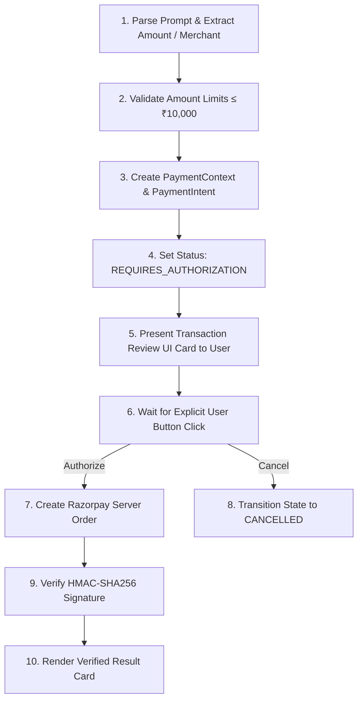

# HELIOS — Payment Intent Planning

## Cognitive Intent Classification

HELIOS strictly separates commercial intent into two categories:

1. **Payment Execution Requests** (Triggers `razorpay_payment`):
   - `"pay ₹500"`
   - `"buy this course for ₹999"`
   - `"purchase this item"`
   - `"make the payment"`
   - `"checkout"`
   - `"complete my purchase"`

2. **Informational / History Requests** (Triggers `general_chat` or history view):
   - `"What is the price of this?"` -> Informational
   - `"How much did I pay?"` -> History query
   - `"Show my previous payments"` -> Payment history view
   - `"Prepare the payment but don't execute it"` -> Preparation only (`REQUIRES_AUTHORIZATION`)

## Step-by-Step Cognitive Execution Plan

