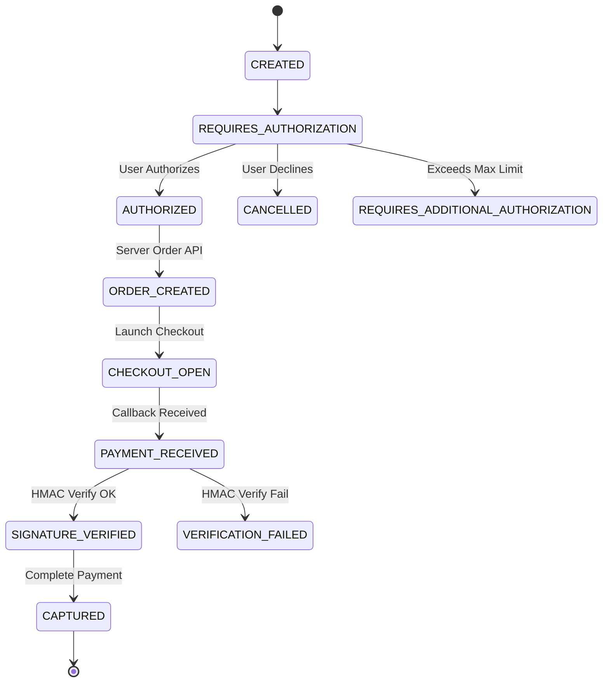

# HELIOS — Payment State Machine

## TransactionState Enum Values

- `CREATED`: Intent registered in repository.
- `REQUIRES_AUTHORIZATION`: Intent prepared, awaiting explicit human approval.
- `AUTHORIZED`: Human user confirmed transaction.
- `ORDER_CREATED`: Razorpay server-side Order created.
- `CHECKOUT_OPEN`: Checkout modal active on client.
- `PAYMENT_RECEIVED`: Raw client callback received.
- `SIGNATURE_VERIFIED`: HMAC-SHA256 signature verified by server.
- `CAPTURED`: Payment captured successfully.
- `FAILED`: Order creation or processing failed.
- `CANCELLED`: User declined transaction authorization.
- `VERIFICATION_FAILED`: HMAC signature check or order mismatch failed.
- `REQUIRES_ADDITIONAL_AUTHORIZATION`: Amount exceeds configured safety threshold (₹10,000).

## State Transition Workflow

