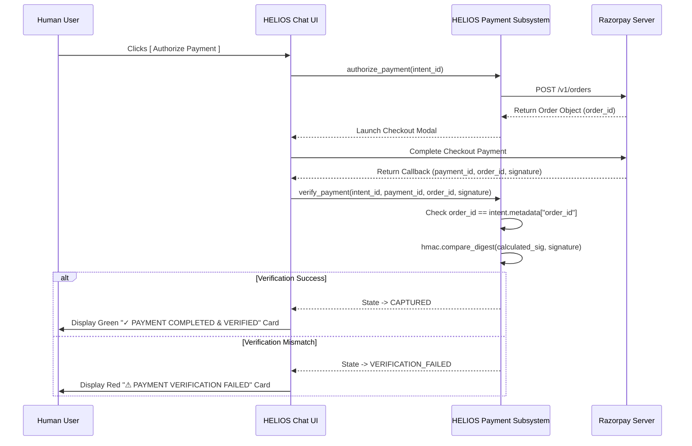

# HELIOS — Payment Verification Flow

## End-to-End Signature Verification Sequence

```mermaid
sequenceDiagram
    participant User as Human User
    participant UI as HELIOS Chat UI
    participant Backend as HELIOS Payment Subsystem
    participant RZP as Razorpay Server

    User->>UI: Clicks [ Authorize Payment ]
    UI->>Backend: authorize_payment(intent_id)
    Backend->>RZP: POST /v1/orders
    RZP-->>Backend: Return Order Object (order_id)
    Backend-->>UI: Launch Checkout Modal
    UI->>RZP: Complete Checkout Payment
    RZP-->>UI: Return Callback (payment_id, order_id, signature)
    UI->>Backend: verify_payment(intent_id, payment_id, order_id, signature)
    Backend->>Backend: Check order_id == intent.metadata["order_id"]
    Backend->>Backend: hmac.compare_digest(calculated_sig, signature)
    alt Verification Success
        Backend-->>UI: State -> CAPTURED
        UI->>User: Display Green "✓ PAYMENT COMPLETED & VERIFIED" Card
    else Verification Mismatch
        Backend-->>UI: State -> VERIFICATION_FAILED
        UI->>User: Display Red "⚠ PAYMENT VERIFICATION FAILED" Card
    end
```
