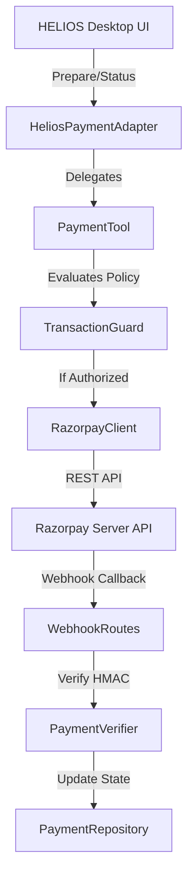

# HELIOS — Razorpay Integration Architecture

## Architectural Overview

The HELIOS Razorpay Payment Subsystem provides a production-structured, agentic payment capability built on Razorpay's server-side APIs. It is implemented as an isolated package (`core/payments`) and standalone backend service (`payment_service`) that prevents financial operations from directly interacting with untrusted LLM outputs.

## Component Boundaries

1. **Isolation Layer (`core/payments/`)**:
   - `payment_config.py`: Environment variable validation & secret masking.
   - `payment_models.py`: Strongly typed dataclasses & `TransactionState` state machine enum.
   - `transaction_guard.py`: Security policy engine & authorization gate.
   - `razorpay_client.py`: Server-side HTTP REST API wrapper & HMAC signature calculator.
   - `payment_verifier.py`: HMAC-SHA256 signature verification & anti-replay webhook processor.
   - `payment_tool.py`: High-level operational interface returning structured JSON responses.
   - `payment_repository.py`: In-memory thread-safe transaction store with idempotency tracking.
   - `payment_trace.py`: Auditable event tracker with automatic secret redaction.
   - `helios_payment_adapter.py`: Interface bridge for HELIOS cognitive planning tools.

2. **Backend Service (`payment_service/`)**:
   - `app.py`: Standard WSGI/HTTP service application.
   - `routes/payments.py`: REST endpoints for `prepare`, `authorize`, `order`, `verify`, and `status`.
   - `routes/webhooks.py`: Endpoint for `POST /webhooks/razorpay`.
   - `services/razorpay_service.py`: Encapsulates server-side payment logic and keeps secrets within backend process.
