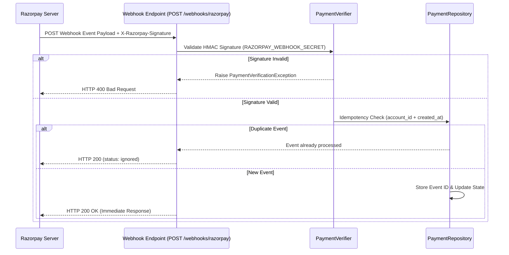

# HELIOS — Webhook Architecture

## Webhook Handling Flow

## Supported Events

1. `payment.captured`: Payment received and captured by Razorpay.
2. `payment.failed`: Payment attempt failed at gateway.
3. `order.paid`: Order completely fulfilled.

## Anti-Replay & Idempotency

- `PaymentRepository.record_webhook_event()` maintains processed event IDs.
- Duplicate webhook calls with identical event timestamps and account IDs are acknowledged with HTTP 200 (`status: ignored`) without reprocessing.
